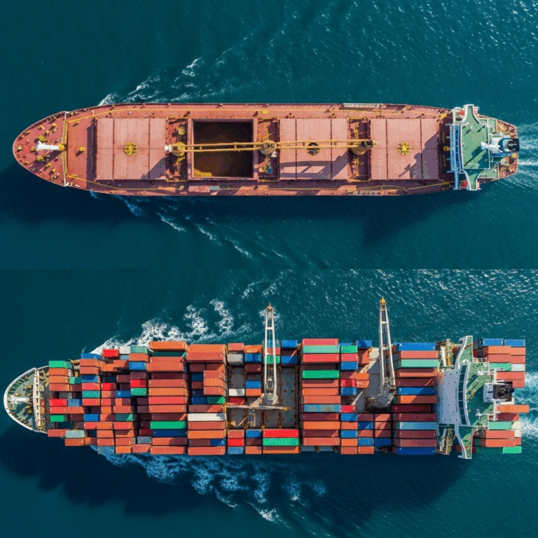

<!--Copyright (c) 2025 Mustafa Uzumeri. All rights reserved.-->

---
title: "Bulk vs Containerized Shipment"
slug: bulk-vs-containerized-shipment
date: 2025-07-16
tags: [thin-markets, trade, canada, explainer]
summary: "A comparison of bulk and containerized grain shipping from Western Canada, examining how container shipping enables premium market access for specialty grains despite higher per-unit costs."
estimated-read: 4 min read
---

<figure class="blog-hero">
  
</figure>

*Originally published on deeperpoint.com, July 2025.*

## Bulk Shipping (Through Grain Traders)

### Pros

- **Significantly Lower Transportation Costs:** Bulk shipping costs are estimated at $2.5 per ton per 1,000 miles, making it much more cost-effective for large volumes
- **Massive Scale Efficiency:** A bulk vessel hold can store 6,000 metric tons of product, equivalent to 250 containers worth of product
- **Established Infrastructure:** In the Vancouver Lower Mainland, there are 20+ terminals where bulk vessels can load and unload
- **Proven Track Record:** Traditional grain trading companies have decades of established relationships and logistics expertise
- **Lower Capital Requirements:** Farmers don't need to manage individual shipments or handle export documentation

### Cons

- **Loss of Premium Pricing Control:** Farmers sell to traders at commodity prices, missing direct premium market access
- **No Product Differentiation:** Grain gets mixed with other producers' products, losing identity preservation
- **Limited Market Access:** Farmers are dependent on traders' market relationships and timing decisions
- **Reduced Profit Margins:** Trading companies capture the premium market margins
- **Minimum Volume Requirements:** Bulk shipping requires minimum volumes (e.g., 6,000 metric tons)

## Container Shipping (Direct to Premium Markets)

### Pros

- **Identity Preservation:** Container shipping allows ease of tracking for premium, identity-preserved products. When shipping a premium product, you can tell which railcar it came from, making it easier to track shipments
- **Higher Profit Margins:** Shippers often realize a greater profit margin from containerized shipping
- **Lower Capital Outlay:** There is a lower capital outlay involved as you can buy in smaller quantities than with bulk shipping
- **Market Access for Smaller Players:** If a small shipper in Saskatchewan is sending lentils, they won't be using a bulk terminal, so the container option lets others play in the market and get access to water
- **Growing Market Share:** Containerized grain shipped through ports at Montreal and Vancouver nearly tripled to 3.87 million tonnes from 1.38 million tonnes in 2001, now constituting close to 10 percent of total grain exports
- **Quality Premium Markets:** Brewers in Japan and China recognized they could get a better handle on quality from the source to the brewery by sending product in smaller batches via containers

### Cons

- **Higher Per-Unit Transportation Costs:** Container shipping is significantly more expensive per metric ton than bulk
- **Container Availability Challenges:** Sometimes it is difficult to find available containers, and it's necessary to ship large volumes (e.g., 80 containers) to save on costs
- **Complex Logistics Management:** Farmers must handle export documentation, quality certifications, and international logistics
- **Container-Specific Risks:** Improper packing of bulk grain cargo can lead to container distortion, spillage, contamination, and injury to workers
- **Rate Volatility:** Container freight rates oscillated dramatically, with rates hitting over $5,900 in July 2024 and decreasing to $3,331 by November 2024

## Current Market Context (2024–2025)

**Favorable Container Trends:**

- U.S. containerized grain exports saw significant growth in 2024, with shipments rising 13% from the previous year, totaling 15.2 million metric tons
- Many of Canada's crops are transported to overseas markets in containers, including half of its lentils, one-quarter of its peas and all its special crops

**Cost Considerations:**

- Current bulk shipping rates: U.S. Gulf to Japan averaging $45.25 per metric ton (down 23% year-over-year), Pacific Northwest to Japan at $26.25 per metric ton
- Global average container shipping cost is $3,397.60 for a 40ft container as of June 2025

## Strategic Implications for Premium Western Canadian Grain

Container shipping costs now approach bulk shipping costs for specialty, smaller-volume sales, particularly when farmers can:

1. **Target Premium Markets:** Japanese and Chinese buyers willing to pay premiums for identity-preserved, traceable products
2. **Leverage Growing Infrastructure:** The Roberts Bank Terminal 2 expansion will specifically support Western Canada's container grain exports to the Indo-Pacific region
3. **Capitalize on Market Inefficiencies:** The "thin markets" approach directly addresses the gap between premium overseas buyers and specialty Canadian producers who can't access bulk shipping minimums

The key success factor will be achieving sufficient scale to make container logistics economical while maintaining the identity preservation and premium pricing that justifies the higher transportation costs per unit.

*[What makes a thin market tick? →](https://deeperpoint.com/thin-markets.html)*
