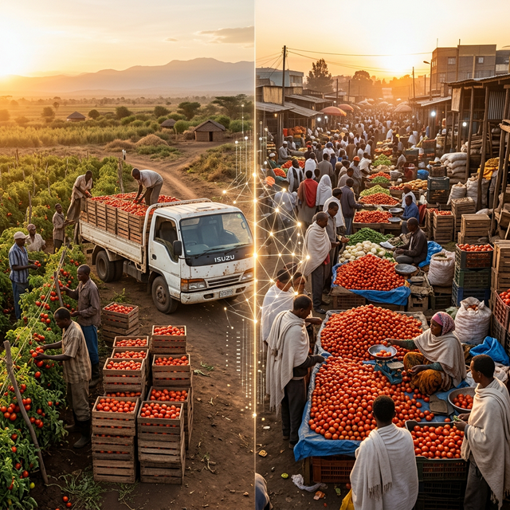

<!--Copyright (c) 2026 Mustafa Uzumeri. All rights reserved.-->

---
title: Tomatoes in the Sun — Why Ethiopia's Fresh Produce Chain Is a Thin Market Problem
slug: ethiopia-produce-thin-market
date: 2026-03-10
tags: [thin-markets, ai, market-design, case-study, cosolvent, knowledgeslot, marketforge]
summary: A smallholder farmer in the Rift Valley and a hotel chef in Addis Ababa are 160 kilometres apart. Between them stand five intermediaries, no cold chain, and a system that wastes a third of everything it touches. This is a thin market.
estimated-read: 13 min read
---

<figure class="blog-hero">
  
  <figcaption>From the Rift Valley to Addis Ababa — the journey that loses a third of what it carries.</figcaption>
</figure>

## Tomatoes in the Sun

Thirty percent. That is the fraction of Ethiopian tomatoes that rot, bruise, or collapse into pulp between the moment a farmer picks them and the moment a consumer might have bought them. In some corridors it is closer to forty percent. The loss is not a mystery, and it is not hidden. It happens in the open air, on the sides of roads, in the backs of overloaded trucks, and on the bare ground of wholesale markets — visible, measurable, and so persistent that every actor in the chain has simply priced it in as the cost of doing business.

I have been studying food distribution systems in developing economies for several months now, and the Ethiopian tomato chain is the most vivid illustration I have found of a pattern that repeats across the Global South. In Mexico, the coyotes who aggregate produce from smallholders in Michoacán capture enormous margins because farmers cannot see the prices at Central de Abasto in Mexico City — and have no way to get their tomatoes there without the coyote's truck. In Niger, onion farmers sell at whatever price a passing trader offers because the next trader might not come for a week, and the onions will not wait. The crops differ. The intermediary titles differ. The structural problem is identical.

The problem is not that supply and demand do not exist. Ethiopian smallholders grow tomatoes in irrigated plots across the Central Rift Valley, East Shewa, and the Jimma zone. Addis Ababa's hotels, restaurants, supermarkets, and open markets need those tomatoes every single day. The problem is that the information required to connect them efficiently — who has what, at what quality, at what price, and when it needs to move — is fragmented across hundreds of villages, thousands of farmers, and a chain of intermediaries who profit precisely because that information stays fragmented.

What if a platform could reach a farmer through a five-dollar phone? What if it could read the market in Addis and tell her, in Amharic over a voice call, that Grade A tomatoes are fetching 35 birr per kilogram today — before the broker arrives at her farm gate and offers her 12? What if the same platform could offer that broker a different deal: steady transport work at predictable margins, instead of the feast-or-famine of speculative buying? What if every transaction the farmer completed built a record that a microfinance institution could use to evaluate a loan?

That's the thin market engineering problem. And to show what a platform like MarketForge could make possible, let me tell you a story. The people you're about to meet are fictional — but the crops, the market forces, and the platform architecture are real. This is a scenario, not a case study: a detailed illustration of what thin market automation could look like if the infrastructure existed.

## 1. Tigist's Harvest

Tigist Bekele farms half a hectare of irrigated land near Meki, a town in the Central Rift Valley about 130 kilometres south of Addis Ababa. She grows tomatoes in the main season and onions and cabbage on rotation. Her plot produces roughly four tonnes of tomatoes per harvest cycle — good quality fruit, mostly Roma varieties suited to the local soil and climate. She and her husband Dawit manage the plot themselves, with two hired labourers during peak harvest weeks.

Until now, Tigist's market access has worked like this: she harvests into rough wooden crates, stacks them by the road, and waits. Within a day — sometimes within hours — a collector arrives in a small truck. He is one of three or four brokers who work the Meki corridor, buying tomatoes from dozens of farmers and aggregating loads for the overnight run to the Addis wholesale markets. He offers a price. Tigist can accept or refuse, but her leverage is limited. Tomatoes do not wait. There is no cold storage within fifteen kilometres. If she refuses today's price, tomorrow's tomatoes will be softer, and the next broker may offer less.

She typically receives between 8 and 15 birr per kilogram, depending on the season. By the time those same tomatoes reach a retailer at Mercato in Addis Ababa, consumers pay 30 to 45 birr. The margin disappears into transport, handling, secondary brokerage at the wholesale market, and — critically — the 25 to 35 percent physical loss that accumulates at every stage. The brokers are not villains. They own the trucks, they absorb the fuel costs and the road risk, and they accept that a significant fraction of every load will arrive damaged or spoiled. Their margin compensates for a genuinely risky and capital-intensive operation. But the structure guarantees that Tigist captures a fraction of her produce's final value, and that consumers pay inflated prices for diminished quality.

This is where the story changes. The Ethiopian Agricultural Transformation Institute, working with a coalition of NGOs and regional agriculture bureaus, has launched a pilot program. The initiative uses a MarketForge-powered platform — configured and curated specifically for the Ethiopian fresh produce sector — to connect participating farmers, transport operators, cold storage hubs, and urban buyers. Tigist hears about it from an extension agent at her local Farmers Training Centre, and from a radio spot in Amharic that says: "Call this number to tell us what you grow. We will help you find buyers."

Tigist's phone is a basic Nokia feature phone — voice and SMS, no data. She dials the number. An AI voice assistant greets her in Amharic. The conversation takes eight minutes. It asks what crops she grows, how much land she farms, roughly how many tonnes she produces per cycle, where she is located, and how she currently sells. Tigist describes her situation in her own words. She does not fill out a form. She does not navigate menus. She speaks, and the system listens.

Behind the scenes, the platform's speech-to-text engine transcribes her Amharic, and the natural language processing layer extracts structured data: crop types, estimated volumes, location, current sales channel, and pain points. It builds two profiles. Her **matching profile** captures what she produces and her constraints — volume, timing, quality characteristics of the Roma tomatoes she grows, her lack of cold storage, her need for prompt payment. Her **gallery profile** — visible to potential buyers — shows a summary of her production: "Smallholder tomato producer, Meki area, Central Rift Valley. Roma varieties. 3–4 tonnes per harvest cycle. Available for aggregation." No personal financial details are exposed.

Tigist receives an SMS confirmation in Amharic: "You are registered. We will contact you when a buyer needs tomatoes from your area."

---

## 2. Henok's Shift

Henok Tadesse has been a produce broker in the Meki corridor for twelve years. He owns two Isuzu trucks and employs three drivers. In a good week during peak tomato season, Henok buys from thirty to forty farmers, fills both trucks, and makes the overnight run to the Ehil Berenda wholesale market near Addis. He earns his margin on the spread between farm-gate and wholesale price, minus fuel, truck maintenance, road tolls, loading labour, and the inevitable spoilage.

Henok is not rich. His income swings wildly with seasonal gluts and lean periods. During peak harvest, wholesale prices crash because too many trucks arrive at Addis simultaneously and the market cannot absorb the volume. His tomatoes compete against identical tomatoes from fifty other brokers' trucks. During lean season, the farmers who have irrigated land charge more, and his margins compress from the other direction. He estimates that in an average year, he loses twenty percent of his cargo to physical damage and spoilage — a cost he absorbs by paying farmers less.

The platform reaches Henok through a different channel. A representative from the pilot program meets him at the Meki market and explains a proposition: instead of buying tomatoes speculatively and absorbing the spoilage risk, Henok can register his trucks as **transport capacity** on the platform. The platform will match his available truck space and routes with pre-arranged loads — farmers whose tomatoes are already committed to a specific buyer in Addis at a pre-agreed price and quality grade. Henok does not buy the tomatoes. He transports them. He is paid a per-kilogram transport fee based on distance and load size.

Henok is sceptical. "I make more money when prices are high," he says.

The representative nods. "And you lose money when prices crash, or when spoilage eats half your load in the rainy season. We are offering you steady work. Every week, guaranteed loads. Your trucks run full both directions — produce up to Addis, and empty reusable plastic crates back to Meki for the next cycle. Your income will not spike as high on the best days, but it will not crater on the worst ones. And your fuel and maintenance costs become predictable."

Henok's onboarding takes ten minutes on his Android phone — he is one of the minority with a smartphone. The platform asks about his trucks: capacity, route capability, availability schedule. It builds a **service profile**: Henok Tadesse, transport operator, two Isuzu trucks, 4-tonne capacity each, Meki-to-Addis corridor, available Monday through Saturday, turnaround time 18 hours.

His income from speculative brokering has averaged about 3.50 birr per kilogram after accounting for all costs and losses. The platform offers a transport fee of 2.80 birr per kilogram — lower per unit, but on guaranteed volume, full loads, and no spoilage risk. Henok does the arithmetic. On a full year basis, the guaranteed model pays slightly more, with far less variance. He registers for the pilot.

---

## 3. Chef Alemayehu's List

Alemayehu Gebre runs the kitchen at a mid-range hotel in the Bole district of Addis Ababa — 65 rooms, a restaurant that serves 120 covers per day, and a conference facility that caters events for international NGOs and business delegations. His daily produce requirement includes 40 to 60 kilograms of tomatoes, plus onions, green peppers, lettuce, and cabbage.

Alemayehu currently sources produce through a combination of Merkato wholesale market and two regular suppliers — small wholesalers who buy at the central market and deliver to hotels. The quality is inconsistent. On a good day, the tomatoes are firm and well-sorted. On a bad day — which is most of the rainy season — he receives soft, bruised fruit that his cooks have to sort through, discarding twenty percent before they can use the rest. He has no visibility into where the tomatoes came from, how they were handled, or how long ago they were picked.

The hotel's general manager enrolled in the platform pilot through a hospitality industry association recommendation. Alemayehu describes his needs through a desktop web interface — the platform supports multiple access channels. He specifies: 40–60 kg tomatoes daily, Grade A preferred (firm, uniform colour, minimal blemish), consistent supply six days per week, delivery to Bole by 6:00 AM.

The platform builds his **demand profile**: high-frequency buyer, quality-sensitive, schedule-dependent, willing to pay a premium for graded, traceable produce. It tags him as an **anchor buyer** — the kind of consistent, predictable demand that can stabilise a thin market.

---

## 4. The Match

The platform's semantic matching engine — Cosolvent Module 1 — does not search by keyword. It matches the structured capability of supply-side participants against the structured requirements of demand-side participants using embedding-based semantic comparison.

Tigist's profile says: Roma tomatoes, 3–4 tonnes per cycle, Meki area, no cold storage, available for aggregation. The platform identifies that six other registered farmers in the Meki corridor grow compatible varieties at similar volumes. Together, they represent roughly 25 tonnes per cycle — enough to justify a consolidated, scheduled supply run.

Alemayehu's profile says: 40–60 kg daily, Grade A, six days per week, delivered to Bole. Two other hotels and three restaurants in Addis have registered with similar requirements, totalling about 350 kg per day.

The match is not "Tigist sells to Alemayehu." The match is systemic: an aggregated supply cluster in Meki, sorted and graded at a newly equipped cold hub operated by a local cooperative, loaded onto Henok's trucks in reusable plastic crates, and delivered to a set of Addis buyers at pre-agreed times, qualities, and prices.

The platform notifies each participant through their preferred channel. Tigist receives a voice call — in Amharic — explaining that her tomatoes have been matched to a buying group in Addis. The call explains the price, the pickup schedule, the grading standards she will need to meet, and the payment terms. "You will be paid within 48 hours of delivery confirmation, directly to your mobile money account."

Henok receives an SMS with his next load assignment: date, pickup location, destination, volume, and his transport fee.

Alemayehu sees the match in his dashboard: source region, estimated delivery time, grade, and price — 28 birr per kilogram, higher than the cheapest undifferentiated wholesale price, but for graded, cold-chain-managed, traceable tomatoes with a guaranteed daily delivery.

---

## 5. The Knowledge Slot in Action

When the Agricultural Transformation Institute configured the platform, they populated the **Knowledge Slot** — the sponsor-curated reference library — with information specific to Ethiopian fresh produce:

- **Post-harvest handling protocols**: grading standards for Ethiopian tomato varieties (colour, firmness, size categories), proper stacking heights for reusable plastic crates, and the temperature and humidity targets for short-term cold storage — drawn from GAIN's E-PLAN research on the Meki corridor
- **Cold storage operations**: SokoFresh-style solar cold room operating parameters, CaaS (Cooling as a Service) fee structures, and capacity planning guidance based on actual pilot data from Kenyan deployments adapted for Ethiopian conditions
- **Transport logistics**: road condition reports for the Meki-to-Addis corridor, optimal departure times to arrive before wholesale markets open, and stacking and ventilation practices that minimise in-transit damage
- **Regulatory and quality standards**: Ethiopian Standards Agency specifications for horticultural products, the E-PLAN recommended packaging protocols, and the MoA's Postharvest Management Strategy guidelines
- **Financial services integration**: how transaction records on the platform can satisfy the documentation requirements for microfinance loan applications, mobile money payment reconciliation, and emerging crop insurance programmes being piloted by the Agricultural Transformation Institute

When Tigist calls the hotline and asks — in Amharic, in her own words — "How do I know if my tomatoes are Grade A?", the Knowledge Slot retrieves the sponsor-curated grading standards and the voice assistant explains: "Grade A means firm, uniform red colour, no cracks or soft spots, and between 5 and 8 centimetres diameter. Sort them before the truck arrives. Place damaged ones aside — you can sell those at the local market for cooking paste."

This is not a web search result. It is vertically specific, locally curated, and delivered in the user's language through a channel she can access with the phone she already owns.

---

## 6. Building a Record That Travels

Here is where the story reaches beyond a single transaction.

Every time Tigist delivers tomatoes to the cold hub, the platform records the event: date, volume, grade achieved, payment received, delivery timeliness. Over three harvest cycles — roughly nine months — Tigist has a documented transaction history showing consistent production, reliable delivery, and verifiable income.

This record has value far beyond produce trading.

**Microfinance access**: Ethiopia's commercial banks and microfinance institutions have historically struggled to evaluate smallholder creditworthiness. Farmers lack formal pay stubs, tax records, or collateral in the conventional sense. But a verified platform transaction history — showing regular income, consistent volumes, and reliable buyer relationships — constitutes exactly the kind of behavioural data that alternative credit scoring models use. The platform, with the farmer's consent, can generate a **credit summary document** that a participating microfinance institution can evaluate. Tigist's nine months of records show average monthly sales of 45,000 birr, a delivery reliability rate of 92 percent, and zero payment defaults. That is a borrower profile.

**Crop insurance**: several pilot programmes in Ethiopia are exploring index-based crop insurance for smallholders — insurance that pays out based on measured conditions (rainfall shortfall, temperature extremes) rather than individual loss assessment. But insurers need the farmer's baseline data to price the policy: what crops, what acreage, what typical income. The platform's transaction history provides exactly that baseline, reducing the insurer's information acquisition cost and making policies viable for farms that would otherwise be too small and too undocumented to underwrite.

**Input supplier credit**: seed and fertiliser suppliers who sell to Tigist's cooperative can see — through the platform's aggregated, anonymised data — that farmers in the Meki corridor consistently produce and sell 25 tonnes of tomatoes per cycle. That aggregate production history supports the cooperative's request for input credit on favourable terms: the supplier knows the production will happen and the income will flow.

The platform does not provide the loans, the insurance, or the inputs. It provides the **verified transaction record** that makes those services possible. For smallholders who have always been invisible to formal financial institutions, that visibility is transformational.

---

## 7. The Web of Relationships

Six months into the pilot, the platform has connected more than just Tigist and Alemayehu. The matching engine has woven a web:

- Sixteen farmers in the Meki corridor are aggregating through the cold hub, supplying a combined buyer group in Addis
- Henok's two trucks run scheduled routes, and a second transport operator has joined, covering the Hawassa-to-Addis corridor for a neighbouring produce cluster
- The cold hub cooperative employs four staff for sorting, grading, and crate management
- Three hotels and five restaurants receive graded, traceable tomatoes at reliable prices
- A tomato paste processor has joined the demand side, purchasing Grade B produce that would previously have been discarded — adding a revenue stream for produce that does not meet Grade A standards but is perfectly usable for processing

The hub has also begun handling onions and green peppers in addition to tomatoes, spreading the fixed cost of the cold room across multiple crops and extending utilisation into seasons when tomato volumes are lower.

---

## 8. What Makes This a Thin Market Story

Step back from the narrative and look at the structural forces.

**Opacity and discovery failure** — Tigist in Meki and Alemayehu in Bole are 160 kilometres apart. Before the platform, there was no mechanism through which they could discover each other based on the specific match between her production capabilities and his quality requirements. The broker chain between them existed not because brokers add unique value, but because no other discovery mechanism existed.

**Information asymmetry** — The defining force. Brokers in the Meki corridor knew the Addis wholesale price. Farmers did not. That asymmetry — which a single voice call delivering real-time price data can begin to correct — anchored the entire margin structure of the traditional chain. An AI voice assistant speaking Amharic on a five-dollar phone changes the information economics of the entire corridor.

**Trust deficit** — Alemayehu had no way to verify whether tomatoes from an unknown farmer in Meki met his quality standards. The platform's grading system, cold-chain management, and transaction history build verifiable trust without requiring face-to-face relationships.

**Geographic dispersion** — Smallholder production is scattered across hundreds of villages. Demand is concentrated in urban centres. The platform aggregates dispersed supply into commercially viable volumes and matches it against structured demand — the core function of thin market engineering.

**Temporal mismatch** — Tomatoes are perishable. Without cold storage, the farmer must sell the same day she picks. The cold hub buys her time — even two or three days of controlled storage shifts the power dynamic from "sell now at any price" to "sell when the match is right."

**The middlemen question** — This is perhaps the most structurally important point. The platform does not eliminate middlemen. It redefines their role. Henok still drives his trucks. He still knows the roads, the loading points, the logistics of getting tomatoes from Meki to Addis alive. What changes is his business model: from speculative margin-capturing broker to reliable, scheduled transport operator. His income is more stable. His risk is lower. His trucks run fuller. And the farmers keep more of the final value. This is not disruption. It is co-optation — channelling existing capabilities into a structure that serves the whole system, not just the link with the most leverage.

## 9. After the Spoilage Drops

Here is what changes. Post-harvest loss on the platform-managed corridor drops from roughly 30 percent to under 10 percent. Two hundred tonnes of tomatoes per year that would have rotted in the sun or been crushed in wooden crates now reach consumers. Farmers in the pilot receive an average of 22 birr per kilogram — nearly double the pre-platform average — because the margin that previously compensated for spoilage and information asymmetry now stays in their pockets. Consumers pay slightly less than the peak-season prices they were accustomed to, for measurably better quality.

And the platform remembers. Every match, every transport run, every grading result, every payment confirmation feeds back into the system. The matching engine gets better at predicting demand patterns. The Knowledge Slot grows as the sponsor adds new content — pest management protocols, irrigation scheduling guidance, new cold storage technology assessments. The thin market thickens, connection by connection.

Tigist's extension agent calls her one afternoon. "A microfinance cooperative in Adama is offering production loans to farmers with verified platform records. Your transaction history qualifies. Would you like to apply?"

She would.

---

*The story of Tigist, Henok, and Alemayehu is fictional — an imagined scenario, not a description of an existing platform or real participants. But the tomato supply chain described is real, drawn from documented research on Ethiopian post-harvest losses, the Meki-to-Addis corridor, GAIN's E-PLAN reusable plastic crate programmes, and SokoFresh's cooling-as-a-service model in East Africa. The market forces are documented, and the harness architecture (Cosolvent, KnowledgeSlot) is under active development. This post illustrates the kind of application a sponsor organization like the Ethiopian Agricultural Transformation Institute, in partnership with NGOs and regional agriculture bureaus, could build using those tools. The operational details — which tomato grades merit which prices, how to calibrate AI voice interfaces for Amharic, how to integrate mobile money settlement with cooperative accounting — are rightly the work of a sponsor embedded in the specific context. The platform provides the matching infrastructure and the domain knowledge layer; the context is always local.*

*[What makes a thin market tick? →](https://deeperpoint.com/thin-markets.html) · [The MarketForge platform →](https://deeperpoint.com/marketforge.html) · [Who should build this? →](https://deeperpoint.com/who-should-care.html)*
