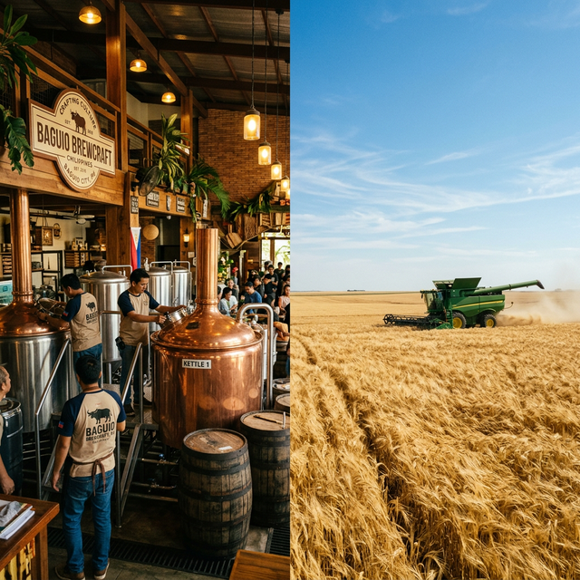

<!--Copyright (c) 2026 Mustafa Uzumeri. All rights reserved.-->

---
title: One Container of Barley — How a Saskatchewan Farmer and a Filipino Brewmaster Found Each Other Across 12,000 Kilometres
date: 2026-03-10
tags: [thin-markets, ai, market-design, case-study, cosolvent, knowledgeslot, marketforge, grain, craft-beer]
summary: A grain farmer in Saskatchewan grows premium two-row malting barley that the big trading companies blend into commodity shipments. A craft brewery purchasing manager in Cebu wants one container of something special for a seasonal lager. They need each other — but neither knows the other exists.
estimated-read: 12 min read
slug: malting-barley-thin-market
---

<figure class="blog-hero">
  
  <figcaption>Golden malting barley ready for harvest on the Canadian prairies — destined for a brewery 12,000 kilometres away.</figcaption>
</figure>

## The Grain in the Bin

Every grain farmer on the Canadian prairies knows the feeling. You grow something exceptional — a two-row malting barley with protein sitting perfectly at 11.8%, plump kernels grading Select, germination energy above 95% — and then you sell it to a grain elevator for the commodity price because there is no other option.

The elevator blends your barley with twenty other farmers' grain. A trading company loads it onto a bulk carrier in Vancouver alongside 6,000 tonnes of similar-enough barley and ships it to a maltster in Japan or China, who buys on grade specification, not provenance. Your barley — the one you selected the seed for, managed the nitrogen on, straight-cut to preserve the hull — disappears into a blending operation that values consistency over character. You get paid $7.50 per bushel. The brewer who eventually uses a malt derived from your barley pays a premium for "imported Canadian two-row" and has no idea your farm exists.

This is the grain trade working as designed. Bulk commodity shipping is extraordinarily efficient: $2.50 per tonne per thousand miles, minimum 6,000-tonne lots, established infrastructure at the port terminals in Vancouver and Prince Rupert. If you are moving wheat or canola at scale, the system is unbeatable. Even the contract infrastructure is built for scale: GAFTA Contract No. 27 — the standard-form agreement used globally for Canadian and American grain cargoes — assumes bulk shipments on CIF terms, sets a minimum 95-tonne tender threshold below which the buyer absorbs extra sampling and analysis costs, and explicitly excludes Pacific coast ports from its scope. Fumigation is optional. Incoterms don't apply. The contract is governed by English law, with arbitration in London. It is a sophisticated, well-tested instrument — designed for trading houses moving shiploads between established counterparties.

But what if you are not moving wheat at scale? What if you are a farmer growing 200 tonnes of a specialty barley variety — CDC Copeland or AAC Synergy — and the buyer who would value that specific grain is not a multinational maltster purchasing 50,000 tonnes, but a craft brewer in Southeast Asia who needs one shipping container (about 24 tonnes) of identity-preserved malting barley for a seasonal beer? That buyer is not just ignored by the grain trade — she is structurally excluded. The standard contract doesn't cover her port, her volume, or her need for variety-specific provenance.

That buyer exists. The container shipping infrastructure exists and is growing — the Port of Vancouver handled record volumes of 170.4 million metric tonnes in 2025, and container throughput jumped 9% that year. Containerized grain exports from Canada have nearly tripled since 2001 and now constitute close to 10% of total grain exports. Identity-preserved grain demand from Japan and South Korea surged in 2025, driven by buyers who want non-GMO and organic segregation that only container shipping can guarantee — each container traceable from farm gate to brewery.

But even the container system has a structural bias against small-lot shippers. In 2025, as import volumes from China hit record highs, shipping lines began disincentivizing grain loading at Vancouver because they wanted empty containers back in Asia immediately to maintain the high-frequency import loop — rather than waiting three to five days for them to be stuffed with grain at a prairie transload facility. Transport Canada's Supply Chain Office has identified "regulatory gaps" in the containerized movement of specialty crops, and CN Rail's 2025–2026 grain plan acknowledges the tension between bulk rail priority and intermodal container service. The infrastructure exists, but it wasn't built for the farmer with four containers of malting barley.

The problem is discovery — and more than discovery. The craft brewer in Cebu has no mechanism to find the farmer in Saskatchewan who grows exactly what she needs. The farmer has no mechanism to find the brewer. They are separated by 12,000 kilometres, fifteen time zones, four languages, and a grain trading system that was designed to move bulk commodities, not to connect individual producers with individual buyers.

That's the thin market engineering problem. And to show what a platform like MarketForge could make possible, let me tell you a story. The people you're about to meet are fictional — but the grain trade dynamics, the shipping infrastructure, and the platform architecture are real. This is a scenario, not a case study: a detailed illustration of what thin market automation could look like if the infrastructure existed.

---

## 1. Darren's Harvest

Darren Fehr is a third-generation grain farmer near Rosetown, Saskatchewan, in the heart of Canada's wheat belt. His family has farmed the same 3,200 acres since his grandfather broke the sod in the 1940s. Darren rotates wheat, canola, lentils, and — on about 400 acres each year — malting barley.

The barley is the crop he cares about most. He grows CDC Copeland, a two-row variety developed by the University of Saskatchewan's Crop Development Centre, prized by maltsters for its clean flavour profile, high extract potential, and consistent modification. Darren manages it carefully: precise nitrogen application to keep protein between 11.5% and 12.5%, fungicide timing to protect the hull, and straight-cutting instead of swathing to preserve kernel integrity.

Last year's crop tested beautifully — 11.8% protein, 95.4% germination energy, 91% plumpness on a 6/64 sieve. Select grade. He delivered it to the elevator at the commodity price: $7.50 per bushel. The elevator operator told him it was "nice barley." Then it went into the bin with everyone else's.

Darren has heard that craft brewers overseas are paying premiums for identity-preserved Canadian malting barley — the kind where the brewer knows the farm, the variety, the field, the harvest date. He has heard that container shipping makes it possible to move 24 tonnes at a time, maintaining traceability from farm gate to brewery. But he doesn't know how to find those buyers, doesn't know how to arrange a container shipment, doesn't know what phytosanitary certificates the Philippines or Vietnam or Taiwan require, and doesn't have the time to figure it out during harvest season.

This morning, between unloading the combine and checking the grain dryer, Darren opens a platform that the Western Canadian Wheat Growers Association has deployed in partnership with the Saskatchewan Trade and Export Partnership (STEP). An agronomist at the Ag in Motion field expo in Langham told him about it last July.

The platform asks him — in plain English, conversationally — to describe his operation: what he grows, what varieties, what grades he typically achieves, what volumes he could allocate for direct export. It builds a **producer profile** from his answers: CDC Copeland malting barley, Select grade, 200-tonne annual availability, identity-preserved (single-variety, single-field harvest), Rosetown Saskatchewan, rail access to both Vancouver and Prince Rupert container terminals.

Darren uploads his most recent Canadian Grain Commission grading certificate and his crop insurance records. The platform's document processing extracts the quality parameters — protein, germination, plumpness, test weight — and attaches them to his profile as verified data points.

His private information — his minimum acceptable price, his willingness to negotiate on payment terms, his harvest timeline flexibility — stays in a matching layer visible only to the platform's AI.

The platform also asks whether he is part of a cooperative or marketing group, or would be interested in joining one. Darren's neighbor, Kyle Savard, grows AAC Synergy on a similar operation near Zealandia, twenty minutes up Highway 7. A third farmer, Brenda Falk near Biggar, grows AC Metcalfe. Individually, each can supply one to four containers per season. Together, the three of them could fill a ten-container order — or offer a buyer a "variety pack" of complementary malting barley profiles from the same growing region, each identity-preserved. The platform registers the aggregation possibility in its matching layer: the **Rosetown Malt Group**, a virtual cooperative, capable of supplying 400+ tonnes of multi-variety malting barley with unified quality documentation and a single logistics coordinator.

---

## 2. Maribel's Problem

Six time zones and 12,000 kilometres away, in Cebu City, Philippines, Maribel Santos is the purchasing manager for Isla Brewing Co., a craft brewery that has grown from a taproom operation to the third-largest craft brewer in the Visayas region. Isla produces five year-round beers and four seasonal releases. The seasonals are what differentiate Isla from the macro lagers that dominate the Philippine market — and seasonals depend on sourcing interesting raw materials.

Maribel's current malting barley comes from a trading company in Singapore that sources Australian bulk malt. It's fine for the year-round lagers. But for the upcoming Habagat seasonal — a dry-hopped lager inspired by the southwest monsoon — she wants something with a cleaner, more biscuity malt character than the Australian base provides. She has read that Canadian two-row barley, particularly varieties like CDC Copeland and AAC Synergy, produces a malt with exactly this profile: crisp, slightly sweet, with a clean finish that lets hop character come through.

She needs one container — approximately 24 tonnes of malting barley — enough for the seasonal run plus experimentation. Not 6,000 tonnes. Not even 100 tonnes. One container.

Maribel has tried the obvious channels. She emailed two Canadian trading companies; neither responded to a one-container inquiry. She contacted a Singapore broker who offered "Canadian two-row" with no variety specification, no farm provenance, and a delivered price that included what she suspected was a 40% margin. She browsed Alibaba and found listings for "Canadian barley" with stock photos and no quality documentation.

The Philippine Craft Brewers Guild, of which Isla is a founding member, recently partnered with the platform — the same one Darren joined from the producer side. The Guild registered as a demand-side sponsor, and Maribel's onboarding is different from Darren's. The platform asks her about brewing specifications — not generic grain categories, but the technical parameters that matter: protein range, germination energy, extract potential, diastatic power, free amino nitrogen levels. It asks about her seasonal calendar, her container logistics preferences (Cebu port or Manila transshipment), and her quality assurance requirements (SGS pre-shipment inspection? Canadian Grain Commission certificate sufficient?).

Maribel also specifies something no commodity listing captures: she wants **provenance documentation** — farm name, variety, field GPS coordinates, harvest date — because Isla will print it on the seasonal's label. "From Rosetown, Saskatchewan to Cebu" is the marketing story. But she can only tell that story if she can verify it.

---

## 3. The Match

The platform's semantic matching engine — Cosolvent's Module 1 — compares Maribel's brewing requirements against the producer profiles in its pool. The match is structural, not categorical. The engine doesn't search for "barley sellers." It evaluates whether Darren's grain, as described by his verified quality data, satisfies Maribel's brewing specifications — protein within her 11.0–12.5% window, germination energy above her 95% threshold, the CDC Copeland variety profile that correlates with the malt character she described as "clean, biscuity, crisp finish."

Darren's 200-tonne availability and Maribel's one-container requirement are compatible. His rail access to Vancouver and Prince Rupert aligns with the Pacific shipping routes to Cebu. His grading certificate is current.

The match confidence is high. Both parties receive notifications.

Darren sees:

> *"A craft brewery in the Visayas region of the Philippines is looking for one container (approximately 24 tonnes) of identity-preserved CDC Copeland malting barley for a seasonal beer production. They require Select grade with protein between 11.0–12.5% and germination energy above 95%. Your most recent grading certificate meets all specifications. The buyer is willing to pay a premium for single-farm provenance documentation. Would you like to review the inquiry?"*

Maribel sees:

> *"A third-generation grain farmer in Rosetown, Saskatchewan, grows CDC Copeland malting barley that grades Select with 11.8% protein, 95.4% germination energy, and 91% plumpness. The grain is identity-preserved — single variety, single field, with a current Canadian Grain Commission certificate. The farmer has rail access to the Pacific coast container terminals. Would you like to review the producer profile and quality documentation?"*

For Darren, the key phrase is "willing to pay a premium for single-farm provenance." For Maribel, it's "identity-preserved" and the precise quality numbers she can verify against the CGC certificate.

---

## 4. What the Platform Knows

When the Western Canadian Wheat Growers Association and the Philippine Craft Brewers Guild configured the platform, they populated the **Knowledge Slot** with domain-specific reference material:

- **Canadian Grain Commission grading standards**: the Select, No. 1, and No. 2 designations for malting barley, the quality parameters (protein, germination, plumpness, test weight), and how to read a CGC certificate — so that Maribel can evaluate Darren's grain against an authoritative standard, not sales claims
- **Container shipping logistics**: a standard 20-foot container holds approximately 24 tonnes of bagged barley. Current freight rates from Vancouver to Cebu averaging $3,300–3,800 per 40-foot container. Liner bag options for bulk-in-container loading. Transit time: 18–22 days via Pacific route. Also: the "empty-return" tension — shipping lines in 2025 prioritized returning empty containers to Asia over waiting for grain loading at prairie transload facilities. The Knowledge Slot helps farmers and buyers time their bookings around container availability cycles and identifies which transload facilities at the Port of Vancouver currently have the shortest turnaround times
- **Philippine phytosanitary and quarantine requirements**: this is the section that saves deals — or kills them. The Philippine Bureau of Plant Industry (BPI) requires an import permit (Sanitary and Phytosanitary Import Clearance, or SPSIC) *before* the shipment departs Canada. The exporter must submit a Prior Notice notification in the BPI's online system on a per-shipment basis — including the bill of lading number, container numbers, commodity description, and phytosanitary certificate reference. The CFIA (Canadian Food Inspection Agency) issues the phytosanitary certificate at origin; it must be submitted *before the shipment arrives* in the Philippines, not after. The grain must be fumigated — typically methyl bromide or phosphine — with a fumigation certificate issued by an accredited pest control operator. Upon arrival at Cebu port, BPI quarantine inspectors will examine the shipment. If documentation is incomplete — a missing fumigation certificate, a Prior Notice not filed, a phytosanitary certificate number that doesn't match the bill of lading — the container goes into quarantine hold. That means port storage charges, re-inspection fees, and delays of one to four weeks. For a craft brewery planning a seasonal release around a specific date, a quarantine hold that turns a 20-day transit into a 45-day ordeal is a production-schedule disaster. The Knowledge Slot makes this compliance chain visible to both Darren and Maribel *before* the grain is loaded, not after it's sitting at the port
- **Reciprocal Canadian export documentation**: CFIA export inspection requirements, certificate of origin, commercial invoice standards, and the documentation sequence — which forms must be issued before loading, which can be completed after
- **Payment and trade finance**: letters of credit (LC) issued through Philippine commercial banks, documentary collection terms, typical payment structures for small-lot grain trades (CAD — cash against documents, or 30-day LC at sight). Currency considerations: CAD/PHP exchange, hedging options
- **Malting barley variety profiles**: technical specifications for Canadian malting barley varieties (CDC Copeland, AAC Synergy, AC Metcalfe) including extract potential, diastatic power, FAN levels, and flavour characteristics — the brewing-relevant data that commodity listings never include
- **Incoterms guidance**: the difference between FOB Vancouver, CFR Cebu, and CIF Cebu — and which allocation of risk, insurance, and freight cost is standard for small-lot container grain trades. Also: why the GAFTA 27 contract template — the global standard for Canadian grain in bulk — doesn't apply to container trades (it excludes Pacific ports, sets a 95-tonne minimum tender, makes fumigation optional, and excludes Incoterms), and what alternative contract structures work for single-container identity-preserved shipments

The Knowledge Slot carries vertical-specific metadata tags — `grain_grade`, `variety_profile`, `shipping_route`, `phyto_requirement`, `quarantine_protocol`, `payment_instrument`, `incoterm` — that scope retrieval so that when Maribel asks "What happens if the phytosanitary certificate number doesn't match the bill of lading?", the platform surfaces the specific BPI quarantine hold procedure and the CFIA re-issuance process — not generic agricultural import guidance.

---

## 5. The Deal

Darren and Maribel communicate through a match-scoped channel. The conversation is practical: Maribel asks whether Darren can bag the barley in 50-kg sacks (her malthouse can't handle bulk). Darren confirms — his local seed cleaning plant offers bagging service. She asks about the harvest timeline. He tells her straight-cutting will happen in mid-August, weather permitting; the grain will be cleaned and graded by early September.

Maribel asks the Knowledge Slot about pricing benchmarks. The platform surfaces current FOB Vancouver prices for identity-preserved malting barley in container lots — $12.50–14.00 per bushel, roughly 60–80% above the commodity elevator price. She and Darren negotiate within that range.

When they agree on terms, the platform moves into **deal structuring**. The deal is not a two-party handshake. The platform identifies the facilitator roles required:

- **Freight forwarder**: a logistics company in Vancouver experienced in grain container shipments, to handle container booking, port handling, bill of lading, and customs documentation
- **Pre-shipment inspection**: SGS or Intertek at the loading point, to verify that the grain loaded matches the CGC certificate
- **Fumigation and phytosanitary preparation**: an accredited pest control operator fumigate the grain before loading (methyl bromide or phosphine, per BPI requirements), then CFIA issues the phytosanitary certificate with the fumigation certificate attached. The platform generates a **compliance timeline**: SPSIC import permit filed by Maribel (or the Guild on her behalf) at least 14 days before the shipping window → fumigation completed and certificate issued → CFIA phytosanitary inspection and certificate → Prior Notice submitted to BPI with bill of lading, container number, and phytosanitary certificate reference — all before the vessel departs Vancouver. Miss a step, and the container sits in quarantine at Cebu port
- **Trade finance**: a documentary collection through Darren's farm credit union and Maribel's commercial bank in Cebu — cash against documents, payment released when Maribel receives the bill of lading, inspection certificate, and phytosanitary certificate as a matched set

The deal structure — producer, buyer, freight forwarder, inspector, fumigator, banking details, pricing, Incoterms (FOB Vancouver), shipping window, phytosanitary compliance timeline, and documentation checklist — is assembled into a **Handoff Artifact**: a structured specification package that each facilitator can act on immediately. The compliance timeline is the critical innovation: it sequences the documentation dependencies so that nothing arrives at Cebu port without the paperwork that prevents a quarantine hold.

---

## 6. What Makes This a Thin Market Story

Step back from the narrative and look at the structural forces:

**Opacity** — Darren in Rosetown and Maribel in Cebu had no mechanism to discover each other. The Canadian grain trade is built for bulk: 6,000-tonne shipments through terminal elevators, purchased by multinational traders who blend and anonymize. A farmer who grows 200 tonnes of exceptional malting barley is invisible to a craft brewer who needs 24 tonnes. The platform's semantic matching — operating on verified quality data, not category labels — makes the discovery possible.

**Information asymmetry** — Darren doesn't know what phytosanitary certificates the Philippines requires. Maribel doesn't know how to read a Canadian Grain Commission report or what "CDC Copeland" means in brewing terms. The Knowledge Slot bridges both gaps — providing Darren with export documentation guidance and Maribel with variety-specific malt analysis data, each in their own context.

**Deal complexity** — A one-container grain shipment across the Pacific is not a simple transaction. It requires a freight forwarder, a pre-shipment inspector, a phytosanitary certificate, a bill of lading, a documentary collection through two banks in two countries, customs clearance at both ends, and Incoterms that allocate risk correctly. For a 6,000-tonne bulk shipment, the trading company handles all of this internally — and uses GAFTA 27, a standard contract template with built-in provisions for quality disputes, force majeure, insurance, and arbitration. For one container shipped through a Pacific port, GAFTA 27 doesn't apply. There is no standard contract. Nobody structures the deal — unless a platform does it.

**Geographic dispersion** — Rosetown to Cebu is 12,000 kilometres, fifteen time zones, and two hemispheres. But the physical shipping infrastructure exists and is affordable — $3,300–3,800 per container. What was missing was the discovery, negotiation, and deal-structuring layer that connects a specific producer to a specific buyer across that distance.

**Participant scarcity** — There are very few craft brewers in the Philippines sourcing directly from Canadian farms, and very few Canadian farmers set up for single-container identity-preserved export. The parties that would benefit most from this trade are the ones least likely to find each other — the definition of a thin market.

---

## 7. After the First Container

Here is what changes. Darren's barley arrives at Cebu port twenty days after loading in Vancouver. BPI quarantine inspectors check the phytosanitary certificate against the Prior Notice filing, verify the fumigation documentation, and open one bag for visual inspection. Everything matches. The container clears quarantine in four hours — Maribel knows, because the platform tracked the compliance timeline and confirmed each document was filed in the correct sequence before the vessel left Vancouver.

Maribel's head brewer runs a pilot batch of the Habagat seasonal and confirms what the variety profile predicted: clean, biscuity malt backbone, crisp finish, excellent hop expression. The label reads "Brewed with CDC Copeland malting barley from Fehr Family Farm, Rosetown, Saskatchewan."

Darren receives $13.25 per bushel — 77% above the elevator commodity price. After freight, bagging, fumigation, inspection, and platform fees, his net is still $10.40 per bushel. For the first time, his barley is worth what his agronomist always told him it should be.

The platform remembers the transaction. Darren's profile now includes a completed, verified export shipment — a credential that positions him for future matches. Maribel's profile captures her quality requirements and seasonal calendar, and the platform proactively alerts her when producers with matching profiles report new harvest data.

Three months later, a craft brewery in Kaohsiung, Taiwan, registers on the platform and posts requirements nearly identical to Maribel's. The matching engine identifies Darren as a high-confidence producer match. And a farmer near Lacombe, Alberta — who grows AAC Synergy, a variety with a slightly different malt character profile — is matched with a microbrewery in Ho Chi Minh City that is experimenting with Canadian malt for a Vietnamese craft pale ale.

Then the larger opportunity arrives. San Miguel Brewery's craft innovation division in Manila posts a requirement for ten containers of premium Canadian malting barley — a mixed order: six containers of CDC Copeland, two of AAC Synergy, two of AC Metcalfe. No individual farmer in the Rosetown area can fill that alone. But the Rosetown Malt Group can. Darren contributes six containers of Copeland, Kyle provides two of Synergy from his Zealandia operation, and Brenda supplies two of Metcalfe from Biggar. The platform manages the blending specification across all three farms — each container identity-preserved to its source farm, but the overall order coordinated through a single deal structure with unified logistics, synchronized fumigation and phytosanitary certification, and one consolidated Prior Notice filing covering all ten containers. The cooperative doesn't need to incorporate or build warehouse infrastructure. The platform *is* the coordination layer.

The system that was designed to move grain in 6,000-tonne bulk shipments between anonymous counterparties is still running. It will continue to move the vast majority of Canada's grain exports. But alongside it, a parallel channel is forming — container by container, or ten containers at a time — connecting individual producers and individual buyers who value provenance, traceability, and the specific character of a grain grown in a specific field, by a specific farmer, for a specific beer.

---

*The story of Darren and Maribel is fictional — an imagined scenario, not a description of an existing platform or real participants. But the grain trade dynamics, the container shipping economics, and the regulatory requirements described are real, the thin market forces are documented, and the harness architecture (Cosolvent, KnowledgeSlot) is under active development. This post illustrates the kind of application a grain growers' association or a craft brewing guild could build using those tools. The operational details — which quality parameters to match on, how to structure documentary collections for small-lot grain trades, how to navigate CFIA phytosanitary certification — are rightly the work of a sponsor embedded in the specific context. The platform provides the matching infrastructure and the domain knowledge layer; the context is always local.*

*[What makes a thin market tick? →](https://deeperpoint.com/thin-markets.html) · [The MarketForge platform →](https://deeperpoint.com/marketforge.html) · [Who should build this? →](https://deeperpoint.com/who-should-care.html)*
