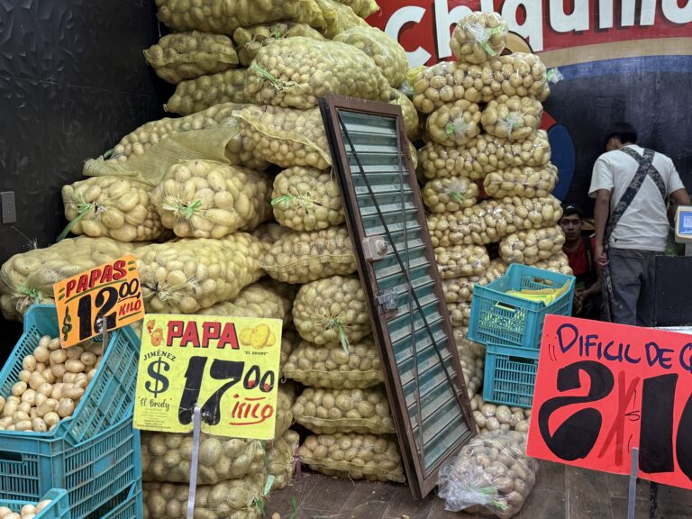

<!--Copyright (c) 2025 Mustafa Uzumeri. All rights reserved.-->

---
title: "The Market That Feeds 22 Million People a Day"
slug: market-that-feeds-22-million
date: 2025-09-29
tags: [thin-markets, market-design, case-study, explainer]
summary: "Mexico City's Central de Abasto — the largest wholesale market on Earth — feeds 80% of a 22-million-person metropolis through a radically different distribution model than the American supermarket chain. It's also the world's most impressive example of a pre-technology solution to thin market thickening."
estimated-read: 6 min read
---

<figure class="blog-hero">
  
</figure>

*Originally published on deeperpoint.com, September 2025.*

I'm standing on a dusty overpass in eastern Mexico City, and laid out before me is something that almost defies belief. It's not a city, but it's bigger than many. It's the Central de Abasto, or CEDA, the largest wholesale market on Earth. From here, you see an endless ocean of warehouses, a blur of 18-wheelers, and a current of human activity that never seems to stop. In a few days, I'm going inside.

This single place is the heart that pumps food through the veins of one of the world's biggest metropolitan areas. A mind-boggling 80% of the food consumed by the 22 million people in the Greater Mexico City area starts its journey right here. It's a model of food distribution so radically different from the one I know in the United States that it fundamentally changes how a city eats.

## The Engine Room

Imagine a space that handles over 30,000 tons of merchandise every single day. That's CEDA. Produce from every corner of Mexico — limes from Veracruz, avocados from Michoacán, mangos from Sinaloa — arrives here in a constant stream. It's offloaded into massive warehouses operated by wholesalers known as *bodegueros*.

Walking through the aisles is a full-body sensory experience. You're hit by the sweet smell of ripe papayas, the sharp scent of cilantro, and the sight of literal mountains of onions and potatoes. Forklifts and workers dart through the organized chaos, breaking down pallet-loads of food that will, within hours, be all over the city.

## The City's Arteries: How Food Reaches the People

So, how does a crate of tomatoes get from a CEDA warehouse to a family's dinner table? This is where the CDMX system diverges sharply from the US. It doesn't rely on a fleet of refrigerated trucks delivering to a handful of giant supermarket chains. Instead, it relies on people.

Thousands of small-scale entrepreneurs descend on CEDA in the pre-dawn hours. They are the owners of stalls in neighborhood public markets, the operators of the weekly mobile markets called *tianguis*, and the ubiquitous street vendors who are a fixture of Mexico City life.

They buy what they can carry, load it up, and take it back to their communities. A crucial link in this chain is the *diablero* — a man with a handcart (called a *diablo*, or "devil") who, for a small fee, will expertly navigate the market to consolidate a vendor's purchases from multiple stalls. The customer walks around the market, selecting goods and paying for them to the bodeguero. With each payment, they get a ticket. When the buyer has completed their shopping circuit, they find a diablero, give the tickets and the diablero (or multiple diableros if the volume is large) knows exactly how to traverse the immense space most efficiently to collect the goods. The diablero delivers them to the customer (likely at their car or truck) and collects the diablero fee. The customer drives off.

The buyers may be local shop owners, street vendors, restaurants, even heads of families who buy for the week. The diableros don't care. There are more than 10,000 diableros in the Centro de Abastos.

## A Tale of Two Systems

My understanding of food distribution in the US was shaped by the "big box" supermarket. In the States, the system is decentralized and corporate. National grocery chains like Kroger or Albertsons don't have one central market; they have networks of massive, private regional distribution centers. Truckload-sized, pre-packaged shipments move with cold-chain precision from these hubs to individual supermarkets.

This model is incredibly efficient for moving massive volumes of standardized goods. But it has a significant side effect, one that has led to the concept of the urban "food desert."

The USDA defines a food desert as a low-income area where residents have to travel more than a mile to reach a large grocery store. Because the US system is built around large stores that require lots of land and customers with cars, "big box" chains have often avoided investing in dense, low-income urban neighborhoods. When smaller mom-and-pop grocers can't compete and close down, residents are left with little more than convenience stores and fast-food joints, creating a void of fresh, healthy food.

## Why Mexico City Avoids the Desert

Mexico City, despite its immense challenges with poverty and inequality, largely avoids the food desert phenomenon. The reason is CEDA.

By acting as a single, accessible, and open wholesale hub, CEDA empowers a massive, informal army of small vendors. These vendors form a dense, granular, and resilient distribution network. Your local street vendor can't compete with Walmart on price for packaged goods, but they can go to CEDA at 4 AM, buy a few crates of fresh avocados and tomatoes, and have them available on a neighborhood corner by 9 AM.

This "last-mile" distribution is done by thousands of entrepreneurs, effectively blanketing the entire city with points of sale for fresh, perishable food. The system thrives on personal relationships, cash, and trust, filling in the gaps that a more rigid, corporate system might miss.

The contrast is stark. The US system is a network of private, corporate hubs built for truck-sized efficiency. The CDMX system is a single, public heart that feeds a resilient, human-scaled network. One prioritizes corporate logistics, the other enables mass entrepreneurship.

## Old School Way to Thicken a Thin Market

The Centro de Abastos takes all of the small-holder farms in central Mexico and gives them access to a single, city-scale market for their goods. CEDA supplies 80%+ of Mexico City and 35%+ of Mexico as a whole. The smallest, most specialized farm, with the tiniest niche produce can find customers at CEDA. This is especially true if they maintain a presence long enough that their dispersed customer base learns where to find their produce.

At DeeperPoint, we wonder if an AI-driven virtual marketplace might somehow replicate the impressive performance of CEDA.

*[What makes a thin market tick? →](https://deeperpoint.com/thin-markets.html) · [Who should build this? →](https://deeperpoint.com/who-should-care.html)*
