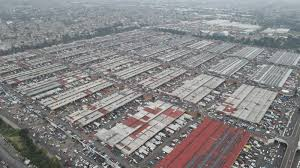
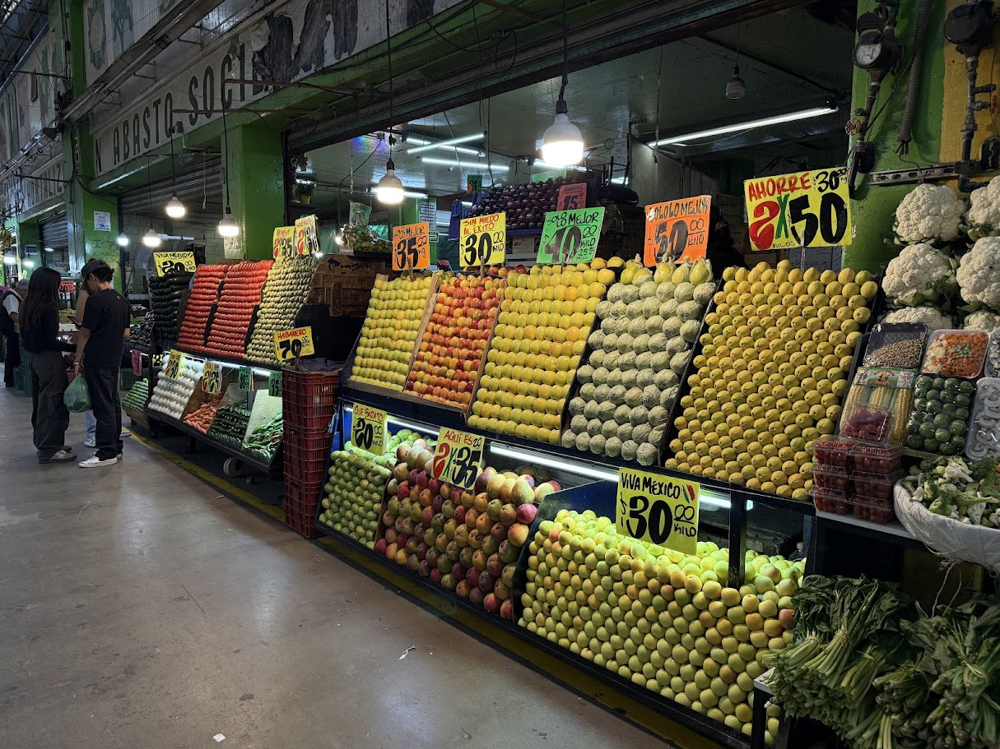
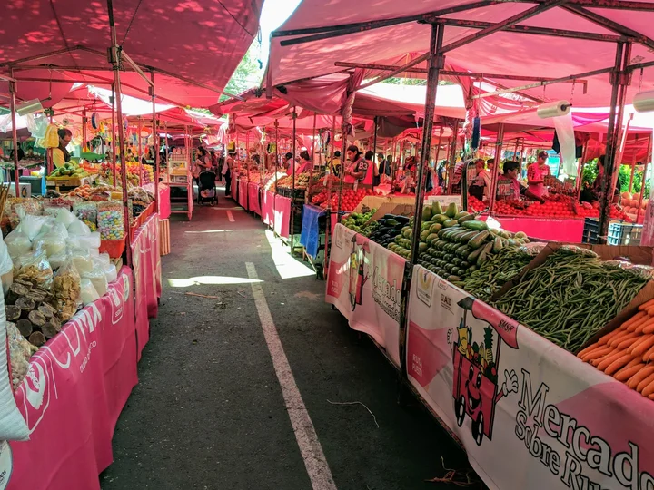
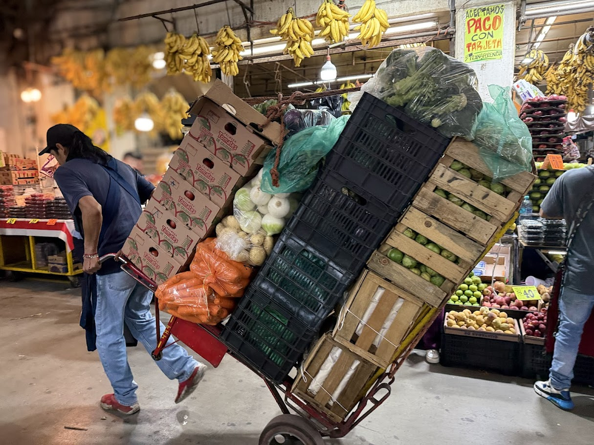
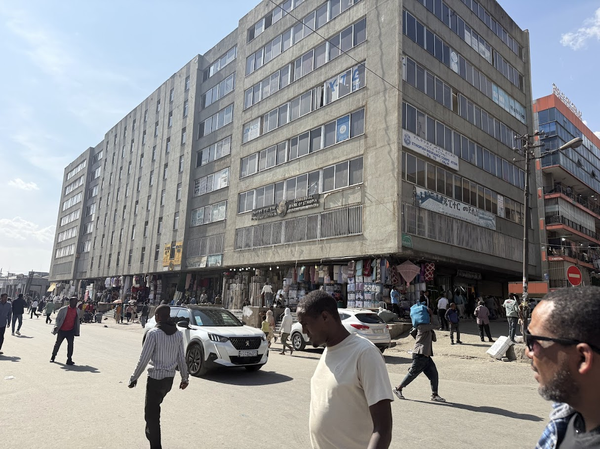

<!--Copyright (c) 2025 Mustafa Uzumeri. All rights reserved.-->

---
title: "Workshop Notes: The Market That Feeds 22 Million People a Day"
slug: market-that-feeds-22-million
date: 2025-09-29
tags: [thin-markets, market-design, case-study, explainer]
summary: "Mexico City's Central de Abasto — the largest wholesale market on Earth — feeds 80% of a 22-million-person metropolis through a radically different distribution model than the American supermarket chain. It's also the world's most impressive example of a pre-technology solution to thin market thickening."
estimated-read: 8 min read
---

<figure class="blog-hero">
  
  <figcaption>The Central de Abasto, Mexico City — the largest wholesale market on Earth. Photo by Mustafa Uzumeri.</figcaption>
</figure>

*Originally published on deeperpoint.com, September 2025.*

I'm standing on a dusty overpass in eastern Mexico City, and laid out before me is something that almost defies belief. It's not a city, but it's bigger than many. It's the Central de Abasto, or CEDA, the largest wholesale market on Earth. From here, you see an endless ocean of warehouses, a blur of 18-wheelers, and a current of human activity that never seems to stop. In a few days, I'm going inside.

This single place is the heart that pumps food through the veins of one of the world's biggest metropolitan areas. A mind-boggling 80% of the food consumed by the 22 million people in the Greater Mexico City area starts its journey right here. It's a model of food distribution so radically different from the one I know in the United States that it fundamentally changes how a city eats.

## The Engine Room

Imagine a space that handles over 30,000 tons of merchandise every single day. That's CEDA. Produce from every corner of Mexico — limes from Veracruz, avocados from Michoacán, mangos from Sinaloa — arrives here in a constant stream. It's offloaded into massive warehouses operated by wholesalers known as *bodegueros*.

Walking through the aisles is a full-body sensory experience. You're hit by the sweet smell of ripe papayas, the sharp scent of cilantro, and the sight of literal mountains of onions and potatoes. Forklifts and workers dart through the organized chaos, breaking down pallet-loads of food that will, within hours, be all over the city.

<figure class="blog-figure">
  
  <figcaption>Inside the Central de Abasto. Photo by Mustafa Uzumeri.</figcaption>
</figure>

## The Road to CEDA: Coyotes and Cash

But all that produce has to get to CEDA in the first place, and the journey from the farm to the warehouse floor is a story in itself.

Mexico's large corporate farms — the operations growing for Soriana, Chedraui, or Walmart de México — largely bypass CEDA entirely. They have the financial clout to negotiate directly with major retailers, accept extended payment terms, and run their own logistics. They don't need CEDA's services.

The smallholders are a different world. A family growing chiles or squash on a few hectares in rural Puebla or Oaxaca doesn't have the volume, the transport, or the leverage to deal with a supermarket chain's purchasing office. What they need is cash — today, not sixty days from now on a corporate payment schedule.

This is where the *coyotes* step in.

The coyotes are independent middlemen who travel to farming communities, buy produce at the farmgate for cash, aggregate loads from multiple smallholders, and transport them to CEDA for resale. The system is ancient — knowledgeable Mexicans I spoke with told me it has operated in some form for generations, possibly centuries. It is arguably a founding institution of rural Mexican commerce.

On one hand, the coyote system works. It gets fresh produce from remote farms to a place where millions of mouths are waiting. It provides the immediate cash that smallholders need. It handles aggregation and logistics that individual small farmers cannot manage on their own.

On the other hand, the coyote sits at the choke point of the system. The smallholder has no alternative buyer standing at the farm gate. There is no transparent price reference. The coyote names a price, and the farmer takes it or watches the crop rot. The information asymmetry is almost total: the coyote knows what prices are running at CEDA; the farmer does not. The value captured by the intermediary is disproportionate to the service provided.

This pattern — cash-based intermediation in isolated rural communities, with stark power imbalances and no institutional oversight — is not just an economic curiosity. The same people who explained the system's history to me observed, carefully, that these rural networks of cash, loyalty, and informal authority have operated for so long and so deeply that they became part of the social fabric from which more dangerous organizations eventually emerged. I'll leave that thread there. The point is that extraction-based intermediation, left to run long enough without alternatives, doesn't stay merely inefficient. It shapes the society around it.

## The City's Arteries: How Food Reaches the People

Once produce arrives at CEDA, the distribution system that takes it the last mile into the city is remarkably different from anything in the United States.

<figure class="blog-figure">
  
  <figcaption>A weekly tianguis in the Condesa district — CEDA's last-mile distribution in action. Photo by Mustafa Uzumeri.</figcaption>
</figure>

Thousands of small-scale entrepreneurs descend on CEDA in the pre-dawn hours. They are the owners of stalls in neighborhood public markets, the operators of the weekly mobile markets called *tianguis*, and the ubiquitous street vendors who are a fixture of Mexico City life.

They buy what they can carry, load it up, and take it back to their communities. A crucial link in this chain is the *diablero* — a man with a handcart (called a *diablo*, or "devil") who, for a small fee, will expertly navigate the market to consolidate a vendor's purchases from multiple stalls. The customer walks around the market, selecting goods and paying for them to the bodeguero. With each payment, they get a ticket. When the buyer has completed their shopping circuit, they find a diablero, give the tickets and the diablero (or multiple diableros if the volume is large) knows exactly how to traverse the immense space most efficiently to collect the goods. The diablero delivers them to the customer (likely at their car or truck) and collects the diablero fee. The customer drives off.

<figure class="blog-figure">
  
  <figcaption>A diablero at work inside the Central de Abasto. Photo by Mustafa Uzumeri.</figcaption>
</figure>

The buyers may be local shop owners, street vendors, restaurants, even heads of families who buy for the week. The diableros don't care. There are more than 10,000 diableros in the Centro de Abastos.

## A Tale of Two Systems

My understanding of food distribution in the US was shaped by the "big box" supermarket. In the States, the system is decentralized and corporate. National grocery chains like Kroger or Albertsons don't have one central market; they have networks of massive, private regional distribution centers. Truckload-sized, pre-packaged shipments move with cold-chain precision from these hubs to individual supermarkets.

This model is incredibly efficient for moving massive volumes of standardized goods. But it has a significant side effect, one that has led to the concept of the urban "food desert."

The USDA defines a food desert as a low-income area where residents have to travel more than a mile to reach a large grocery store. Because the US system is built around large stores that require lots of land and customers with cars, "big box" chains have often avoided investing in dense, low-income urban neighborhoods. When smaller mom-and-pop grocers can't compete and close down, residents are left with little more than convenience stores and fast-food joints, creating a void of fresh, healthy food.

## Why Mexico City Avoids the Desert

Mexico City, despite its immense challenges with poverty and inequality, largely avoids the food desert phenomenon. The reason is CEDA.

By acting as a single, accessible, and open wholesale hub, CEDA empowers a massive, informal army of small vendors. These vendors form a dense, granular, and resilient distribution network. Your local street vendor can't compete with Walmart on price for packaged goods, but they can go to CEDA at 4 AM, buy a few crates of fresh avocados and tomatoes, and have them available on a neighborhood corner by 9 AM.

This "last-mile" distribution is done by thousands of entrepreneurs, effectively blanketing the entire city with points of sale for fresh, perishable food. The system thrives on personal relationships, cash, and trust, filling in the gaps that a more rigid, corporate system might miss.

The contrast is stark. The US system is a network of private, corporate hubs built for truck-sized efficiency. The CDMX system is a single, public heart that feeds a resilient, human-scaled network. One prioritizes corporate logistics, the other enables mass entrepreneurship.

## Brute-Force Market Thickening

In the language of [thin market theory](https://deeperpoint.com/thin-markets.html), CEDA is a textbook case of **geographic concentration** — one of the oldest and most aggressive approaches to making a thin market thick.

The problem CEDA solves is fundamental. Mexico has hundreds of thousands of small farms producing an enormous variety of crops, and Mexico City has millions of consumers and thousands of small vendors who need to buy from them. Without CEDA, each farm faces a painfully thin market: a handful of local buyers, little price discovery, and no leverage. The produce market of central Mexico would be fragmented into countless isolated micro-markets, each too small to be efficient.

CEDA's answer is blunt and physical: bring *everything* to *one place*. Collapse the geographic distance. Collapse the search friction. Let every seller see every buyer, and every buyer see every seller. The smallest, most specialized farm — growing an obscure variety of chile or a niche herb — can find customers at CEDA if they maintain a presence long enough that their dispersed customer base learns where to find their produce. CEDA supplies 80%+ of Mexico City and roughly 35% of Mexico as a whole.

This is market thickening by sheer force of concentration. No algorithms, no AI, no digital platforms — just a massive physical space and the gravitational pull of 22 million appetites. It is, in effect, the largest pre-technology solution to the thin market problem anywhere on Earth.

But the brute-force approach has limits, and the coyote system reveals the most important one. CEDA thickens the market *inside its walls*. The journey to those walls — getting produce from the farm to the bodega — remains thin, opaque, and dominated by intermediaries whose power depends on the isolation and information asymmetry of the producers they serve. CEDA doesn't reach back to the farmgate. The smallholder selling chiles in rural Oaxaca experiences a thick market only vicariously, through whatever price a coyote is willing to pay that morning.

At DeeperPoint, we wonder whether an AI-driven virtual marketplace could replicate CEDA's impressive thickening effect — while extending it past the warehouse walls, all the way back to the farm. The underlying desire to exchange is clearly there. The infrastructure question is whether technology can collapse the distances that concrete and steel cannot.

## Postscript: The Merkato

Two months after visiting CEDA, I was in Addis Ababa and walked through the Merkato — the largest open-air market in Africa. The Merkato is smaller than CEDA but unmistakably its East African cousin: the same logic of geographic concentration, the same teeming human energy, the same role as the gravitational center of a city's food supply.

<figure class="blog-figure">
  
  <figcaption>The Merkato, Addis Ababa — the largest open-air market in Africa. Photo by Mustafa Uzumeri.</figcaption>
</figure>

What struck me, though, was not the similarity but the difference in trajectory. Ethiopia, Uganda, and several other East African nations are actively experimenting with digital platforms designed to connect smallholder farmers more directly with urban markets. Platforms like Ethiopia's Birrama and OpenAgriNet, and Uganda's Kudu and EzyAgric, are early-stage efforts to do precisely what the coyote system resists: give small producers transparent price information, direct access to buyers, and alternatives to extractive middlemen. The technology is still nascent and the challenges — rural connectivity, digital literacy, trust — are real. But the intent is explicit: use technology to extend market thickness past the warehouse walls and back to the farm.

In a sense, East Africa may be a step closer to the [MarketForge](https://deeperpoint.com/marketforge.html) vision than Mexico — not because its markets are more advanced, but because its reformers are already asking the right question.

*[What makes a thin market tick? →](https://deeperpoint.com/thin-markets.html) · [Who should build this? →](https://deeperpoint.com/who-should-care.html)*
