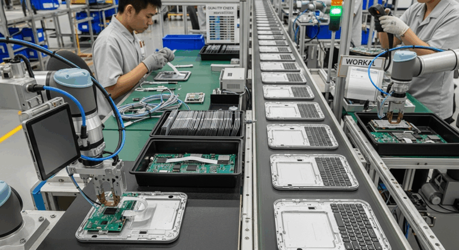

<!--Copyright (c) 2025 Mustafa Uzumeri. All rights reserved.-->

---
title: "Repetition, Lean Thinking, and Thin Digital Markets"
slug: repetition-lean-thinking-thin-markets
date: 2025-08-29
tags: [thin-markets, market-design, ai, cosolvent, explainer]
summary: "In manufacturing, repetition drives excellence. In thin markets, repetition is exactly what's missing. LLM+RAG systems can create a layer of 'digital repetition' — shared memory that enables continuous improvement even when individual participants rarely encounter the same deal twice."
estimated-read: 3 min read
---

<figure class="blog-hero">
  
</figure>

*Originally published on deeperpoint.com, August 2025.*

In manufacturing, repetition is the key to excellence. Systems like Lean Manufacturing, Kaizen, and Just-In-Time production rely on continuous, incremental improvement of processes that are performed over and over again. But what happens when markets are thin — when transactions are rare, participants change frequently, and no two deals look exactly alike?

In thin markets, the absence of repetition makes it difficult to accumulate learning. Each transaction is treated as unique. Mistakes are repeated. Knowledge is lost. Efficiency gains are minimal. Traditional Software 1.0 solutions exacerbate this by forcing structure onto situations that are inherently unstructured or too infrequently used to justify heavy-handed data standardization.

## How LLM+RAG Can Introduce "Digital Repetition"

Even in situations where human participants are unlikely to encounter the same deal twice, AI systems can:

- **Spot patterns** across many diverse transactions
- **Suggest best practices** based on accumulated knowledge
- **Continuously improve** the quality of matches and recommendations

In effect, LLM+RAG systems can create a layer of digital repetition: a shared memory that enables ongoing refinement, even in markets where individual human actors see only sporadic action.

## Toward Thicker Digital Markets

By bringing this kind of memory and pattern recognition to thin markets, AI can help "thicken" them over time — making them more efficient, more robust, and more accessible. Cosolvent is being built with this vision in mind: to take the lessons of manufacturing efficiency and apply them to the complex, messy world of market matching. The result could be smarter, faster, and fairer markets — even in places where no traditional system has worked before.

*[What makes a thin market tick? →](https://deeperpoint.com/thin-markets.html) · [The MarketForge platform →](https://deeperpoint.com/marketforge.html)*
