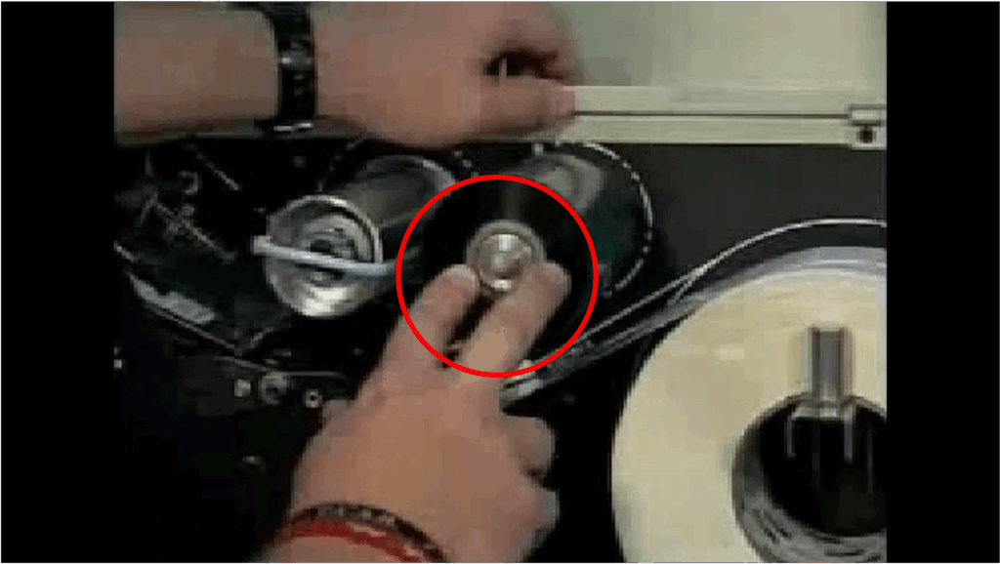
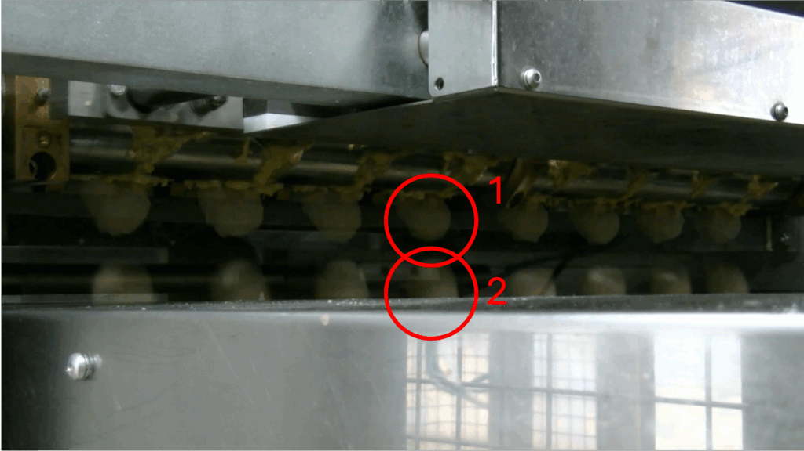
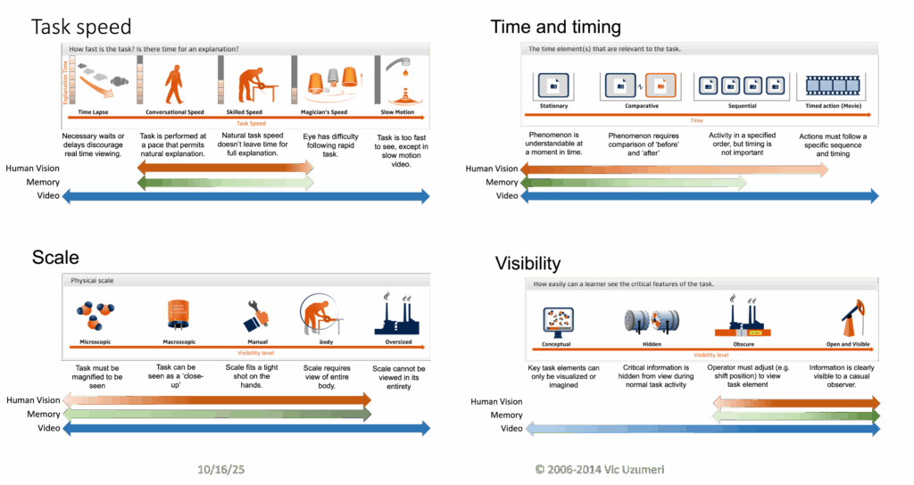
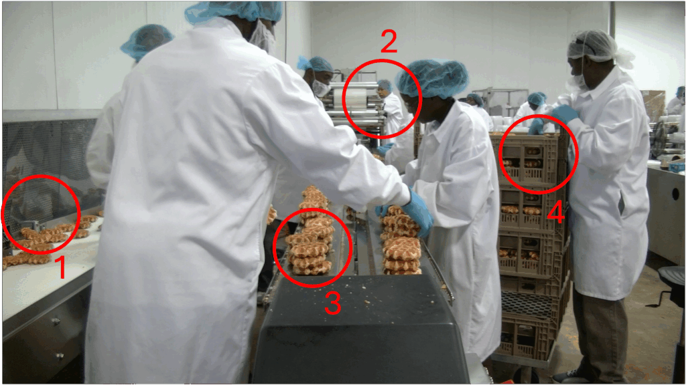

<!--Copyright (c) 2025 Mustafa Uzumeri. All rights reserved.-->

---
title: "Why AI Won't Take Over Work … At Least for a While"
slug: why-ai-wont-take-over-work
date: 2025-10-23
tags: [ai, technology, explainer]
summary: "Monolithic frontier LLMs face fundamental barriers to replacing human work: trade secrets, tacit knowledge, sensorimotor expertise, rapidly changing domain knowledge, and the social networks that hold organizations together. A case for distributed AI instead."
estimated-read: 10 min read
---

*Originally published on deeperpoint.com, October 2025.*

I've watched with bemusement as AI enthusiasts advocate the need for massive investment in gargantuan datacenters and ever-larger LLMs. A few nights ago, I attended a seminar where a very smart (I daresay brilliant) presenter explained an economic model that predicted astounding AI growth and a surprising trajectory for wages and human work. The proposed model had a core assumption that presumed that LLMs will grow huge in order to achieve AGI and perform every intellectual task that we can throw at them. Since that pattern actually sort of matches what we are witnessing so far, the audience seemed to accept it without objection. However, I have been using and studying, and above all documenting and teaching about complex operations and systems for more than 40 years and I see so many areas where the monolithic AI model will be a really bad fit with human activity — especially commercial and technical activity.

## In the Real World, Everything Has Secrets

LLMs learn from what's written down, or maybe soon from what's in a video. However, many real-world tasks are not well documented in text, image or video. The closer one comes to actual tasks and work, the more likely you are to encounter knowledge that someone is intentionally keeping secret or that someone doesn't know exists or doesn't know how to share.

There is a vast, hidden world of knowledge that is rightly considered "secret", "sensitive", or "proprietary". What could possibly be worse than having your precious trade secrets or medical history become visible to anyone that questions a frontier LLM? How do we protect that information in a frontier model? We can protect it in a conventional IT system. We might be able to protect it in the RAG to a sandboxed local LLM, but are we willing to trust that a prompt to ChatGPT won't break it down? Even if that is technically prevented, how many individuals and organizations around the world will trust that assurance?

How can an LLM provide accurate guidance when a lot of critical information is explicitly hidden from it? If the answer is to arm-twist people into sharing that info with the LLM trainer, or make it available as RAG to a frontier LLM, good luck with that. A lot of organizations, companies and people will likely take a pass.

### Tacit Knowledge

In a previous life, I produced over 500 projects involving video-based eLearning for Fortune 100 companies. They covered everything from plant floor safety to machine tool usage to software applications to HR policy to sales techniques. I can't recall even one project where we didn't have to call the front-line subject matter expert and quiz them at length about some undocumented details. AFAIK, we never met a project where we could go directly from the manual or digitized design documents to a finished explanation. This type of undocumented, but essential knowledge is termed "tacit". Tacit knowledge is everywhere and it always lives where the action is.

There are all kinds of tacit knowledge. One of the most interesting is sensorimotor knowledge. In one very simple training video, an operator shows how to change the ribbon on a Zebra barcode printer. Given that Zebra printers are everywhere, one might assume that everything required to explain their use would be written in their user manual. Except it wasn't.

<figure class="blog-figure">
  
  <figcaption>Frame from a training video we made in the late 2000s. The operator demonstrates how much force is needed to push a ribbon onto the tensioning spindle — undocumented sensorimotor knowledge that caused real problems on the factory floor.</figcaption>
</figure>

The operator is instructed to push the new ribbon onto a spindle that has a tensioning mechanism. The ribbon is held tight by friction. The challenge is to get the newbie operator to push the ribbon through the significant resistance that the mechanism exerts. The company we were helping had a lot of problems with operators who were too timid to push hard. It also had damaged printers from operators who literally took a hammer to the ribbon, even though part of the cardboard roll spindle was folded over and effectively blocked insertion. The video used voice instructions and relied on human ability to read the body language in the video to show pretty accurately how much force was reasonable.

How can you capture this type of subtle "tribal knowledge" to train an LLM? … or accurately describe it to a RAG embedding? The printer ribbon example only caused a problem from time to time, so until we made the video, no one had noted the concern, let alone made a systematic attempt to explain it. It also wasn't the only bit of undocumented detail that was associated with that machine. Little snippets of tacit knowledge were scattered throughout the finished training video … and that was one of the simplest we ever made.

Even if there are no sensorimotor issues, organizational tasks are riddled with "tribal knowledge". Experienced employees have memories of problems or opportunities that were resolved years ago. They may use private methods that work better than the manual. They may know who to call — be it vendor, expert, or company alumni.

I can attest that significant information gaps surfaced in every one of the 500 videos we produced. We had to ask, read, investigate, or test to find a suitable answer. What methodology will AI use? How long will it take for AI to capture the tacit knowledge that lies behind the tasks it hopes to automate?

## Mysteries

Many things in real life are complex or hard to see with the naked eye. Consider a device with a set of nozzles that each eject a ball of dough that will later be baked into a sweet pastry. Every second or two, another row of dough balls is ejected onto a conveyor. When we watched and filmed the operation, every row seemed identical. Then, to be double sure, we took some frames from later in the video and made them partially transparent to lay over an earlier video sequence. Lo and behold, even though the two overlaid frames were synchronized to match the exact moment when the cycle began, the dough balls fell at different times.

<figure class="blog-figure">
  
  <figcaption>Two video frames overlaid and synchronized to the start of the cycle. The dough balls fell at different times because a sensor waited for the correct dough volume before releasing — a detail that wasn't in the manual.</figcaption>
</figure>

If this is an automated machine, how could they be so different?

We contacted the plant manager who had installed the machine. He informed us that there was a sensor just above the nozzles that measured when enough dough had entered the nozzle to guarantee a dough ball of the correct size. Then, and only then, did the machine release the correctly sized ball. We only saw this behavior because the video was captured at 60 frames per second. The balls fell at different times because the dough was not absolutely consistent. Even though it all came from the same batch in a big hopper above the nozzles, the dough could vary in consistency even within the same batch. Then the sensor would drop the balls at a different time. The manager knew that, but he didn't think it was in the manual. Plus, the manual was on paper and he wasn't sure where it was shelved.

If you think deeply about real-world tasks, you will find important tasks that are hard to see or study. Tasks that happen too fast or too slow. Tasks that require careful sequencing and precise timing. Tasks that are too big or too small to view clearly. Tasks where the mysteries occur inside a black box where they are invisible to the casual viewer.

<figure class="blog-figure">
  
  <figcaption>Four dimensions that make real-world tasks opaque to casual observation — and to LLMs trained on written documentation.</figcaption>
</figure>

If you take a really close look at almost any human activity or process, you will find some unexplained mysteries or undocumented subtleties. If these are not widely understood, or written down — or what is written is not digitized — hardly anyone will even know that these subtleties exist. How is the LLM supposed to learn about them?

### Will LLMs Be Team Players?

This last example is perhaps the most mundane, and possibly the most profound. Picture a pastry production line where four things are happening simultaneously. Pastries are constantly flowing through an opening beside a plastic bagging line, coming from a 50+ metre continuously moving belt through a long oven. The company doesn't ever want to stop the belt, because that would scrap hundreds of perfectly good pastries.

The workers are grabbing the pastries as they emerge and stacking them beside a conveyor that will take them one at a time into a machine where they are automatically placed and heat-sealed into a plastic bag. If everything works properly, the pastries are bagged as fast as they come through from the oven.

What happens when there is a stoppage or problem in the bagging machine? The pastries are arriving, but the bagger cannot process them. One worker is not running the bagging machine — he is frantically trying to clear the jam. Another worker just ran over and pulled a rolling stack of clean racks to absorb the overflow. All of the workers are quickly stacking the pastries on every clean surface and passing them to the operator with the rack. Everyone is wearing gloves so they can handle the pastries as needed.

<figure class="blog-figure">
  
  <figcaption>Spontaneous teamwork on the pastry line. When the bagging machine jams, the team reorganizes instantly — no programming, no rehearsal, just humans doing work the way they normally do.</figcaption>
</figure>

This is the type of mundane teamwork that infuses every human activity. When something needs to be done, humans adjust as a group to meet the challenge. It's likely that stoppages like this happen often enough that no one thinks twice. If there is a newbie on the line, the old hands just tell them where to stand and what to do. No prior programming or rehearsal. Just humans doing work the way they normally do.

I have yet to see a treatise on AI that explains how AI will mimic human teamwork. That applies even when the teamwork is planned and choreographed. I am at a loss to imagine how it will coordinate the types of spontaneous, no-drama adjustments that this team routinely displayed.

## Knowledge Changes Rapidly

A chef invents a new recipe, a carpenter adjusts to wood grain, a nurse senses subtle patient distress. These experiences generate new tacit data that could fundamentally change an AI's observations or recommendations — if it is captured in time. That, however, seems to me to be a hugely challenging task. In sensory and improvisational (and perhaps many other) domains, humans will remain the lead innovators for some time. AI can assist — suggesting combinations, tracking outcomes — but the loop between perception and adjustment remains biological. That gap is not a flaw; it's a stabilizer. It gives societies time to adapt, reassign labor, and revalue human skills.

## The Illusion of Frontier LLM Efficiency

The global AI race is being waged through the construction of enormous datacenters — billion-dollar fortresses of silicon and power designed to host frontier models like GPT-5, Claude Opus, and Gemini 2.0. Each promises to understand anything, reason about everything, and serve everyone. But there are obvious situations where a monolithic LLM will perform poorly or be wasteful.

Frontier LLMs are capital-intensive and slow to diffuse. Each deployment version requires massive investment in GPUs, networking, and power. The marginal cost per token is low, but the upfront capital is immense — limiting access to a few corporations and governments.

**As long as public, personal use is allowed, some of the LLM workload will be socially trivial.**

More and more people are falling in love with LLMs, but that means a large fraction of all inference cycles go to low-stakes chat, marketing copy, or routine rephrasing — tasks that could be handled by far smaller systems. These interactions are valuable at the individual level but socially inefficient: they consume extraordinary compute for negligible financial or social gain. Worse, there is little correlation between the "value" of a query and the resources it draws from the LLM.

Consider the Puppy-Name Paradox Prompt:

> "I just adopted a rescue puppy who is half Siberian Husky, half Corgi. Her personality blends the gravitas of a philosopher and the chaos of a street magician. I want a name that evokes both Arctic myth and Renaissance wit, is pronounceable in English, Japanese, and Swahili, has a Scrabble score divisible by 7, appears in no Google results as of 2025, and would sound dignified if shouted across a park during a thunderstorm. Suggest five possibilities and explain the reasoning for each."

This sounds like a frivolous naming task, but it forces the model to do linguistic constraint solving, balance cultural references, simulate sound aesthetics, reason about search plausibility, and narratively justify choices. If these uses are allowed, the most general intelligences ever built will spend much of their time on work that doesn't require them. Meanwhile, the infrastructure that supports them — power-dense datacenters, complex cooling, high-bandwidth networks — runs at colossal cost.

**Another inefficiency comes from asking a general AI to support boutique expertise.**

Organizations are beginning to train specialized LLMs for medicine, law, manufacturing, or local governance. These capture the tacit (and generally local) knowledge of real-world experts — the hard-won judgment of how work actually gets done. But that knowledge is intensely contextual. Once encoded, it rarely transfers beyond its niche. The result is a proliferation of narrowly applied models — brilliant inside their bubble, useless outside it. If they are built on a large, frontier LLM, the local detail means that most of the LLM's effort will be expended on a very narrow topic.

## Network Resilience and Social Integration

A monolithic LLM economy also implies a brittle network architecture. Every inference requires a round-trip from the user to the datacenter and back, forming a global star topology. Bandwidth limits, reliability, and latency become systemic bottlenecks — the opposite of the Internet's original design for resilience and redundancy. Can a factory really risk its low-level operations on the reliability of its Internet connection? What about its safety and security systems?

## The Case for Distributed AI

If monolithic, centralized LLMs are not the way to go, what is? I think that means moving from monolithic, centralized cognition toward distributed, multi-tiered AI.

Distributed small language model (sLM) networks invert the logic. They scale horizontally: many small nodes, each affordable, each improvable. Their capital requirement per node is low; their adoption rate is fast. Like Wi-Fi routers or smartphones, they spread through millions of local decisions rather than a handful of billion-dollar builds. sLMs grow through peer imitation. Over time, distributed systems reach more people, languages, and contexts — creating a broader base of participation and innovation.

This approach mirrors the layered topology of the Internet — decentralized, cache-rich, and failure-tolerant — rather than a fragile "hub-and-spoke" system. Intelligence flows outward in all directions instead of upward. Distributed AI, embedded in communities and workflows, would turn job replacement into job co-evolution. People teach (and re-teach) their local systems and those systems amplify their reach. Rather than a few frontier models dictating the terms of progress, billions of smaller systems can learn, differ, and recombine — a living ecology of cognition.

That structural change makes human integration far more natural. When intelligence lives near the work, people remain essential. A decentralized network of AIs doesn't replace human labor wholesale; it embeds alongside it, enriching judgment, adaptation, and creativity. The resulting system would be multi-layered:

- **Core models** provide broad linguistic and reasoning ability.
- **Domain distillates** adapt that intelligence to law, medicine, or engineering.
- **Contextual agents** run close to users, fine-tuned for local data and norms.
- **Edge models** handle everyday, privacy-sensitive, or offline tasks.

### Sequencing the Shift: From Monolith to Mesh

Building a monolithic AI network is conceptually simple: construct massive datacenters, train vast frontier models, and connect every device to a centralized reasoning core. Shifting toward a distributed ecosystem is far more intricate. It's not just a technical evolution — it's a phasing and staging challenge that touches supply chains, human behavior, and learning itself. Decentralization cannot happen in one sweep. It will unfold through overlapping waves of technological readiness and social adaptation.

Each step depends on progress in three interlocking systems:

- **Hardware diffusion** — affordable local accelerators and inference kits must proliferate.
- **Software coordination** — retrieval, caching, and provenance protocols must mature.
- **Human learning** — workers and institutions must internalize new models of collaboration and control.

These dependencies mean decentralization will emerge organically, not linearly — a sequence of experiments, feedback loops, and gradual trust building rather than a single technological leap.

Frontier models and local systems will evolve together. Large models distill their general reasoning into smaller descendants; small models return human corrections and tacit context through federated feedback. Each side trains the other, forming a cognitive supply chain in which intelligence gradually migrates outward from the datacenter into the fabric of daily work.

*[What makes a thin market tick? →](https://deeperpoint.com/thin-markets.html)*
